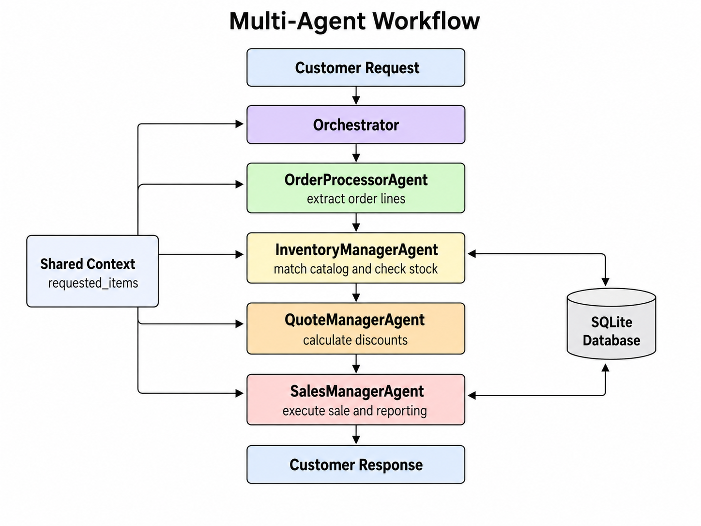
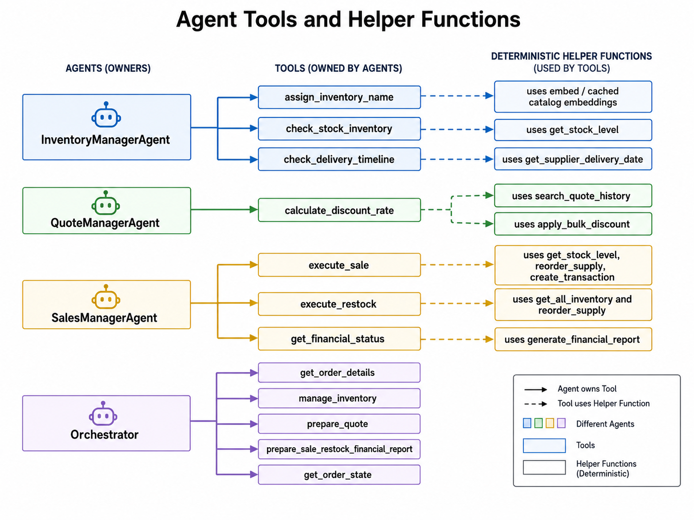

# Beaver's Choice Paper Company — Multi-Agent Inventory & Quoting System

<p align="center">
  
</p>

An end-to-end multi-agent system that automates the complete order lifecycle of a paper supply company — from a free-text customer email to a booked sale in the ledger. Built with [`smolagents`](https://github.com/huggingface/smolagents), Pydantic, and SQLite.

## The Challenge

The Beaver's Choice Paper Company was losing sales to slow, error-prone manual operations. Every incoming customer request required someone to:

- Process the request: customers write in free text ("we need glossy sheets for a gala next Friday"), often naming products loosely and mixing several items in one message
- Check inventory in real time: stock levels change with every sale, and a quote based on stale numbers means a broken promise
- Decide on restocking: when stock is short, is it worth ordering from the supplier? Can it arrive before the customer's deadline? Is there enough cash?
- Price competitively: discounts should reflect order size and past quoting history
- Close the sale reliably: record the transaction without double-charging, overselling, or corrupting the ledger

Doing this by hand doesn't scale; automating it naively with a single LLM prompt is unreliable — one hallucinated stock number or invented delivery date corrupts real financial data.

## The Solution

This project solves the problem with four specialized agents plus the orchestrator, each owning one stage of the order lifecycle and sharing typed workflow state through a common `Context`:

- A shared Pydantic model (`RequestedItem`) is stored in `Context` and enriched in place by each stage, avoiding prompt-chained JSON/schema passing between agents.
- Catalog matching is deterministic: customer item descriptions are embedded with BGE-M3 and compared against cached catalog embeddings.
- All financial and inventory logic lives in deterministic Python tools: stock math, discount rules, supplier reorders, restocking, and ledger writes are handled in code.
- Defensive guards at every stage: execution-order checks, duplicate-sale protection, shortfall re-verification at sale time, and cash-balance checks before supplier purchases limit inconsistent state.

The result: a customer request goes in as plain text and comes out as a priced, verified, executed (or transparently declined) order, with the database as the single source of truth at every point in time.

---

## Project origin

This project builds on Udacity’s Agentic AI capstone starter:

[Udacity starter project](https://github.com/udacity/agentic-ai-c4-exercises-demos/tree/main/project)

The starter provides the base dataset, catalog, database setup, and utility scaffolding. The multi-agent workflow in this repository was implemented and then substantially refactored to use shared typed state, deterministic embedding-based catalog matching, consolidated sales/post-sale handling, and structured final-state retrieval.

## Architecture


The system uses 4 specialized agents, all implemented as `ToolCallingAgent` instances and coordinated by a top-level orchestrator:

*Figure 1. End-to-end multi-agent order-processing workflow, showing orchestration, shared state, database interactions, and the customer response path.*


| Agent | Responsibility | Tools |
|---|---|---|
| **Orchestrator** | Coordinates the workflow and composes the final customer-facing answer from structured order state | `get_order_details`, `manage_inventory`, `prepare_quote`, `prepare_sale_restock_financial_report`, `get_order_state` |
| **Order Processor** | Extracts requested items from free text and appends typed `RequestedItem` objects to shared workflow state | `extract_item_description` |
| **Inventory Manager** | Matches customer wording to the catalog using embeddings, checks stock, and verifies supplier timing for shortages | `assign_inventory_name`, `check_stock_inventory`, `check_delivery_timeline` |
| **Quote Manager** | Applies a discount based on historical quote data or requested quantity | `calculate_discount_rate` |
| **Sales Manager** | Reorders shortfalls when feasible, executes sales, restocks low inventory, and generates the financial report | `execute_sale`, `execute_restock`, `get_financial_status` |

### Agent tools and helper functions


*Figure 2. Agent-owned tools and the deterministic helper functions they use for inventory, quoting, sales, restocking, and financial reporting.*


### Data flow

Requested items are stored once in `Context.requested_items` as typed Pydantic `RequestedItem` objects and mutated in place throughout the workflow:

1. `order_line_id`, `item_description`, `requested_quantity`, `order_date`, `delivery_date` (Order Processor)
2. `matched_catalog_item`, `can_fulfill`, `shortage_quantity`, `supplier_order_feasible`, `supplier_delivery_date` (Inventory Manager)
3. `discount_rate` (Quote Manager)
4. `sale_completed` (Sales Manager)

The Sales Manager also owns post-sale restocking and financial reporting. The orchestrator then calls `get_order_state` to retrieve the authoritative structured state before composing the customer response.

This replaces the earlier design that serialized `RequestedItem` objects and repeatedly passed model JSON/schema text through agent prompts.

## Business logic

### Inventory & reordering
- Stock levels are computed from the `transactions` table (stock orders minus sales) as of the request date via `get_stock_level`.
- If stock is insufficient, `check_delivery_timeline` uses `get_supplier_delivery_date` (lead time scales with quantity: same-day up to 10 units, up to 7 days for >1000 units) to decide whether a supplier reorder can arrive before the customer's delivery date.
- `reorder_supply` purchases the shortfall at 75% of the retail unit price (`SUPPLIER_PRICE_FACTOR = 0.75`), but only if the current cash balance covers the cost. Purchases are logged as `stock_orders` transactions.

### Quoting & discounts
`calculate_discount_rate` first searches historical quotes (`search_quote_history`) for a matching request:

- History found → discount by past `order_size`: large = 20%, medium = 10%, otherwise 0%.
- No history → discount by requested quantity: ≥1000 units = 20%, ≥100 units = 10%, else 0%.

### Sales execution
`execute_sale` guards against several failure modes:
- Duplicate execution: `Context.sold_order_line_ids` prevents double-selling the same order line within one order.
- Stale shortfall data: the actual shortfall is recomputed at sale time and compared against the Inventory Manager's figure; on mismatch the sale is aborted.
- Final stock check: stock is re-verified after any supplier reorder before the sale transaction is written.
- Successful sales are recorded at `(1 − discount_rate) × unit_price × quantity` as `sales` transactions.

The orchestrator's final answer reports one of three verdicts: fulfilled, partially fulfilled (listing which items shipped and which didn't, with delivery dates), or cannot be fulfilled. Its prompt explicitly forbids fabricating transactions, dates, or orders.

### Post-sale restocking & reporting
The Sales Manager performs post-sale operations immediately after sale execution:
- `execute_restock` scans inventory as of the request date and reorders items below their configured minimum stock level.
- `get_financial_status` calls `generate_financial_report` and stores a validated `FinancialReport` in shared context.

---

## Project structure

```
.
├── data/
│   ├── quote_requests.csv         # Historical customer inquiries used to seed the database
│   ├── quote_requests_sample.csv  # Sample requests used by the scenario runner
│   └── quotes.csv                 # Historical quotes used to seed the database
├── images/                        # Architecture and project images used in the README
├── src/
│   └── supply_chain_agents/
│       ├── __init__.py
│       ├── agents.py              # Four specialized agents + Orchestrator
│       ├── config_logging.py      # Application logging configuration
│       ├── config.py              # Paths, DB engine, embedding model, workflow constants
│       ├── context.py             # Shared typed workflow state injected into agents/tools
│       ├── inventory.py           # PAPER_CATALOG (names, categories, unit prices)
│       ├── main.py                # Entry point: builds Context and runs the scenarios
│       ├── models.py              # RequestedItem + FinancialReport Pydantic models
│       └── utils.py               # Database, inventory, finance, date, and helper functions
├── tests/                         # test scripts and results
├── .env                           # OPENAI_API_KEY (not committed)
├── .gitignore
├── pyproject.toml                 # Project metadata, dependencies, and build configuration
└── README.md
```

### Database (SQLite via SQLAlchemy)

| Table | Purpose |
|---|---|
| `transactions` | Ledger of all `stock_orders` and `sales` (drives stock levels and cash balance) |
| `inventory` | Reference table of stocked items (~40% random coverage of the catalog, seeded) |
| `quote_requests` | Historical customer inquiries |
| `quotes` | Historical quotes with job type, order size, and event type metadata |

The company starts with a $50,000 cash balance and randomized initial stock.

---

## Setup & usage

### Requirements

- Python 3.10+
- An OpenAI API key (the system uses `gpt-4o-mini` via smolagents' `OpenAIServerModel`)

```bash
pip install -e .
```

### Configuration

Create a `.env` file in the parent directory of the source folder:

```
OPENAI_API_KEY=sk-...
```

The model is instantiated with `temperature=0.0` and `parallel_tool_calls=False` for deterministic, sequential tool execution.

### Run

```bash
python main.py
```

This will:
1. Initialize the database (`init_database`): tables, historical quotes, seeded inventory, starting cash.
2. Load and date-sort the test scenarios from `quote_requests_sample.csv`.
3. Process each request through the orchestrator, printing the response plus updated cash and inventory value after every order.
4. Print a final financial report and write all results to `test_results.csv`.

---

## Design decisions

- Shared typed state over prompt chaining: `RequestedItem` objects live in `Context`, so agents enrich the same authoritative state instead of passing serialized model JSON/schema text between prompts.
- Deterministic matching and tools: catalog embeddings are cached once, semantic matching is done in Python, and all money/inventory-affecting logic remains deterministic.
- Simpler orchestration: sales and post-sale responsibilities are handled by the same agent, reducing unnecessary agent boundaries.
- Guard rails at every stage: stage-ordering checks, duplicate-sale protection, shortfall re-verification, and cash-balance checks before supplier orders limit inconsistent state.
- Point-in-time correctness: Stock and cash are always evaluated as of the request date, so replaying historical requests in order produces a consistent ledger.

## Possible improvements (WIP)

- Improve catalog matching with a two-stage retrieval pipeline: use embedding similarity to retrieve the top-k catalog candidates, then apply a reranker before selecting the final match. This should better preserve attributes such as paper size, finish, weight, and material.
- Handle multiple order lines that map to the same catalog item more robustly, since earlier sales can make previously calculated shortage quantities stale.
- Improve quote-history matching by considering or reranking several similar historical quotes instead of relying only on the top-1 result.